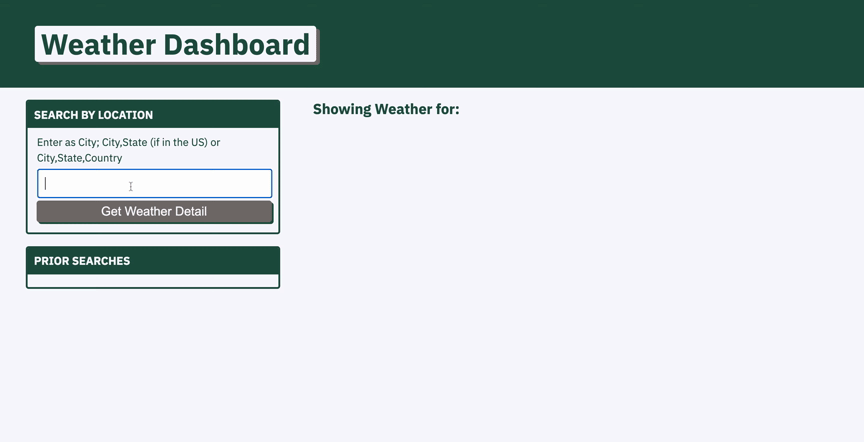

# weatherdashboard-hw6
# Weather Dashboard Homework Assignment 6 
## Michigan State University Coding Bootcamp 

Project By: 
Ian Hennessey 
GitHub Profile:  <https://github.com/atleastitsanethosman> 
Project GitHub Repository: <https://github.com/atleastitsanethosman/weatherdashboard-hw6> 
Project URL: <https://atleastitsanethosman.github.io/weatherdashboard-hw6/> 

## Project Description
The goal of this project was to generate a weather dashboard for a traveler.  The dashboard allowed the traveler to search by city and find the weather for the current day as well as the 5 days going forward.  It would also safe a history of recent searches and include some visual elements to help the traveler understand the weather conditions quickly.

## Footage of Deployed Application

## Project Elements: 

1. A input area allowing the traveler to search by location.

2. A prior searches area, limited to 5 recent searches, allowing the traveler to quickly pull up weather data from recently visited cities.

3. A large card showing weather data for the current day including an icon reflecting the conditions and a color coded note on the UV index to indicate severity of UVI conditions.

4. Smaller cards showing weather conditions for the next 5 days along with icons to give a visual representation of conditions.

## Citations: 
Moment <https://momentjs.com/> 
jQuery <https://jquery.com/> 
Google Fonts <https://fonts.google.com/> 